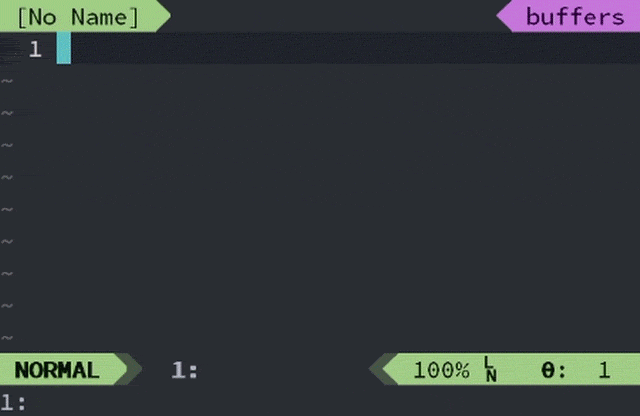

# EditJekyllPost.vim



Quickly create Jekyll post.

`ejek` is an abbrev for `EditJekyllPost`. Type `:ejek` and whitespace, then
it will be automatically replaced by `:EditJekyllPost `.

## Example

```vimL
:EditJekyllPost new-post-title
```

If today is March 18, Vim will open `2016-03-18-new-post-title.md`.
In addition, if `_posts` directory exists on the current directory, 
Vim will alternatively open `_posts\2016-03-18-new-post-title.md`.

## Configuration

```vimL
let g:editJekyllPost#defaultExtension = ".md" 
let g:editJekyllPost#defaultLayout = "post"
let g:editJekyllPost#postsDirectory = "_posts\\"
```

Note: `g:editJekyllPost#postsDirectory` must ends with path separator.
Default configuration is for Windows. On Linux or Mac, use `_posts/`

## Install (Pathogen)

```vimL
git clone https://github.com/retorillo/editjekyllpost.vim.git ~/.vim/bundle/editjekyllpost.vim
```

## License

The MIT License
Copyright (C) Retorillo
